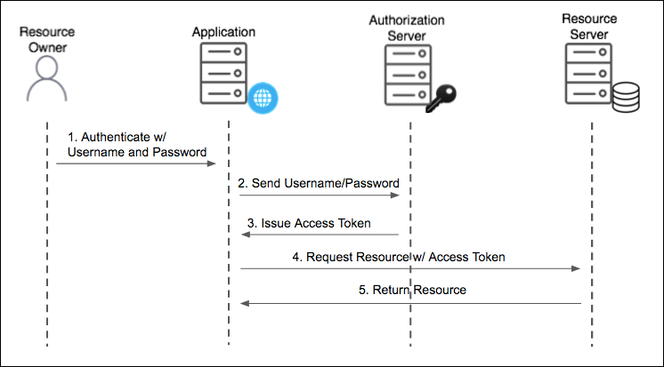

# Security
## JWT
it is an encoded string that can contain unlimited amount of data.
It is cryptographically signed.

There is no middleman so server can trust it.

However, JWT does not guarantee the encryption although
it is good at guarantee data ownership. Anyone who can intercept
the token.

JWT is a good technology for API authentication and server to server authorization.
It is a not a good choice for sessions.

### Usage
Basically when you create your service, you register your service
to an API dashboard to get a secret token.
This token will be used to sign your jwt token created on the client side.

### Components
JWT is composed of a header, payload, and signature.

### JWT vs JWS vs JWE vs JWK
JWT is a **standard format that can be signed or encrypted**. If JWT is **signed**, we call it JWS (JSON Web Signature). If JWT is **encrypted**, we call it JWE (JSON Web Encryption).

- #### JWS
JWS claims are signed with a signature ([_private key_](#Private_Key)) that can be verified by the server with a secret signing key ([_public key_](#Public_Key)). This way we can **verify whether the content is tampered with when passed between client and server**. As the content of JWS is not encrypted, use JWS only when you want to exchange nonsensitive data in the claim or in the payload of the token.

- #### JWE
JWE encrypts the content instead of signing it. The content being encrypted here are JWT claims. The JWE **can be signed and enclosed in a JWS**.

- #### JWK
JWKS (JSON Web Key Set) is a set of keys which contains the public keys used to verify JWT issued by the authorization server and signed using RS256 signing algorithm. JWKS is **used to verify JWT, but not used to decrypt JWT**. User can specify whether the specific JWK is used for encryption or for verification. [reference](https://stackoverflow.com/questions/60538047/jwt-private-public-key-confusion)

### Summary
JWT is useful when it comes to its stateless characteristics.
It is designed to be used to ensure the authenticity of the source, and one
token can be used in different applications.

However, the token cannot be revoked before its expiry time. Regardless you changed
your password and id, the token that has already been generated will still be valid.
Even you deleted token in browser, the token itself is still valid until its expiry time.

## Authentication vs Authorization
### Authentication
is the process of verifying the identity of a user by obtaining some sort of credentials for example his username password combination.

### Authorization
is the process of allowing an authenticated user to access his resources by checking whether the user has access rights to the system.
You can control access rights by granting or denying specific permissions to an authenticated user.

### OAuth
OAuth is not an API or a service. it is an open standard for authorization.

It is a standard to securely access stuff with randomized tokens.

OAuth (Open Authorization) is an open standard for token-based authentication and authorization which is used to provide single sign-on (SSO). OAuth allows an end user's account information to be used by third-party services, such as Facebook, without exposing the user's password.

### OAuth Grant Types
- ##### Authorization code grant
- ##### implicit grant
- ##### Resource owner credentials grant
- ##### Client Credentials grant
- ##### Refresh token grant

You will have two tokens when you use OAuth.
* access token
* refresh token

Access token is used to validate your identity to access some content.
Refresh token is used to renew your access token when your token expired.

## Authorization code grant
used by the web applications

- ###### Client
The client is the application that is trying to get access to the user's account. Client has to be registered with the Resource Server prior making any requests. New client has to provide:
  - Application name
  - Redirect URL: URLs for the client for receiving the authorization code
  - Grant Types, authorization type that will be followed by this client to get access to the user resources.
  - Hostname: URL that will be allowed to request the resource server via API calls.

  In return to the client registration, the client gets an **Client ID** and **Client Secret (a password to be kept securely in the env files)** that are uniquely created for it.  

- ###### Resource Owner
The entity that can grant access to a protected resource. (actual user)
- ###### Resource Server
API server that is used to access the user's information. API that helps to make the post happen on twitter (example)
- ###### Authorization Server
The server that presents the authentication page, where user (resource owner) approves this permission. The popup that opens up, where username, a password is asked for, and the permission to post the tweet is shown. (example)

The authorization code is a **temporary code** to get an access token. The code itself is obtained from the authorization server where the user get a chance to see what the information the client is requesting, and approve or deny the request. [reference](https://medium.com/@anuj.ladia/understanding-oauth-2-0-with-authorization-code-flow-a81eaf1980eb)

## Implicit grant
used by the apps SPA running on the user's browsers.

The implicit grant is a simplified flow that can be used by public clients (clients that have not been registered), where the access token is returned immediately without an extra authorization code exchange step (Authorization Code grant). The implict grant is specifically used for clients with in-browser applications as it **minimizes the number of calls needed** to obtain an access token. **However, security is a concern since the access token is sent in the URI fragment which can be exposed to unauthorized parties and risk being misused for client impersonation**. [reference](https://www.iamteam.com/post/implicit-grant-vs-authorization-code-in-isam)

*Implicit grant is generally not recommended*

## Resource Owner Password Credentials grant (Password grant)
used by the trusted applications

The client's credentials are directly exchanged in return for the access token. Password grant was included in OAuth2.0 specification as a temporary measure to migrate old applications from legacy authentication mechanisms such as HTTP Basic Authentication or crendential sharing, and onto an OAuth tokenized architecture. [reference](https://www.scottbrady91.com/oauth/why-the-resource-owner-password-credentials-grant-type-is-not-authentication-nor-suitable-for-modern-applications)

One big benefit of Authorization code grant is that **user credentials are now only passed into a single application: your authorization server**. However, with the password grant, **every application, including 3rd parties, would need to gather the user's credentials**. With password grant, every client application must be as secure as your authorization server and account for every type of attack against end-user authentication systems.

## Client Credentials grant
used for machine to machine communications

Similar to Authorization code grant, client has to be registered with the resource server. Mostly, Client Credentials grant is for apps that can request an access token and access resources on its own. These apps often use services that call APIs without users. [reference](https://docs.pivotal.io/p-identity/1-14/grant-types.html)

## JWT vs OAuth
JWT is just a token format. OAuth is a protocol.
In other words, OAuth can use JWT as a token to authorize clients.

## Single Sign-On (SSO)
SSO is not a protocol. It is more of a high-level conceppt used by a wide range of service providers.
SSO is an authentication / authorization flow through which a user can log into multiple services using the same credentials.

## ISAM and SAML
### SAML (Security Assertion Markup Language)
SAML is an open standard used for authentication. Its primary role in online security is that it enables you to access multiple web applications using one set of login credentials. Based upon the xml format, web applications use SAML to transfer authentication data between two parties - the [_identify provider_](#identity-provider) (IdP) and the service provider (SP). [reference](https://www.onelogin.com/learn/saml)

### ISAM
is a suite of IBM middleware components that provides web portal protection using Identity Management. It provides an authentication and authorization solution while acting as a [_reverse proxy web server_](#reverse-proxy-web-server).

### PingFederate
is a self-hosted enterprise federation server that enables user authentication and single sign-on developed by Ping, similar to identity management system tools developed by Microsoft and Okta.

### SSL/TLS
#### SSL vs TLS
TLS (Transport Layer Security) is the successor of SSL (Secure Socket Layer).

SSL/TLS is a protocol that secures the communication between client and server using public key and [_symmetric key cryptography_](#private-key).

#### SSL/TLS Handshake
Client and server come across each other for the first time. The handshake involves a number of steps that start from validating the identity of the other party and **concludes with the generation of a common key (secret key)**.

During a TLS handshake, both parties exchange messages verify:
- identity
- agree on cipher suite
- TLS version to be used
- establish the session keys

**Flow of TLS handshake**
1. client request the handshake with the server by providing the cipher suite and SSL/TLS version
2. server checks the cipher suite and SSL/TLS version. If it is valid, server will provide its certificate and public key to the client
3. client verifies the certificate and encrypt pre-master key (shared secret key) using the server's public key, and send it back to server.
4. server decrypt the encrypted key using its public key.
5. any further communication between client and server will be done using pre-master key (shared secret key).
[reference](https://cheapsslsecurity.com/blog/what-is-ssl-tls-handshake-understand-the-process-in-just-3-minutes/)

## SSL vs Access Token based communication
Both of SSL and Token-based auth should be used based on your context. Two methods are used based on the need and security context.

- **Token-based Auth (OAuth)** usually used in a scenario where there is a need to establish a secure communication between mobile app/web app and api server. Where password is not stored in the device. It stores a temporary token to the device which expire over time.

- **SSL** authentication can be good candidate for establish a secure communication between two servers.

[reference](https://stackoverflow.com/questions/39741736/mutual-ssl-vs-token-based-auth)

## Terms
### Identify Provider
is a service that stores and manage digital identities. [reference](https://www.okta.com/identity-101/why-your-company-needs-an-identity-provider/)

### Reverse Proxy Web server
is a go-between or intermediary server that forwards requests for content from multiple clients to different servers across the internet. Usually, reverse proxy server will sit **behind the firewall in a private network** and directs client requests to the appropriate backend server.
- #### Load balancing
Reverse proxy server can distribute client requests across a group of servers in a manner to maximize speed and capacity utilization. If a server goes down, the load balancer redirects traffic to the remaining online servers.
- #### Web acceleration
Reverse proxy server can compress data or perform additional tasks such as SSL encryption to boost web performance.
- #### Security and anonymity
Reverse proxy server can protect identities of backend servers and act as an additional defense against security attacks.

### Access Token
is meant for an API and should be validated only by the API for which it was intended. If you received an JWT access token from an identity provider, you do not need to validate it. You can pass it to the issuing IdP and the IdP takes care of the rest.

### Public Key
is only used to encrypt data. As its name suggest, public key can be used by anyone but it cannot be used to decrypt data. Public key is also called **asymmetric cryptography**. [reference](https://www.preveil.com/blog/public-and-private-key/)

### Private Key
is used to both decrypt and encrypt data based on the strategy you choose (public key - encrypt, private key - decrypt or use private key for both encrypt and decrypt). This key is shared between the sender and receiver of the encrypted sensitive information. Private key is also called **symmetric cryptography**. [reference](https://www.preveil.com/blog/public-and-private-key/)

### Asymmetric Encryption
encrypts and decrypts the data using two separate yet mathematically connected cryptographic keys. These keys are known as a public key and a private key. (public key - encryption, private key - decryption) [reference](https://cheapsslsecurity.com/blog/what-is-asymmetric-encryption-understand-with-simple-examples/)

### Symmetric Encryption
encrypts and decrypts the data using one secret key. The entities communicating must exchange the key so that it can be used in the decryption process. [reference](https://www.cryptomathic.com/news-events/blog/symmetric-key-encryption-why-where-and-how-its-used-in-banking#:~:text=Symmetric%20encryption%20is%20a%20type,used%20in%20the%20decryption%20process.)
