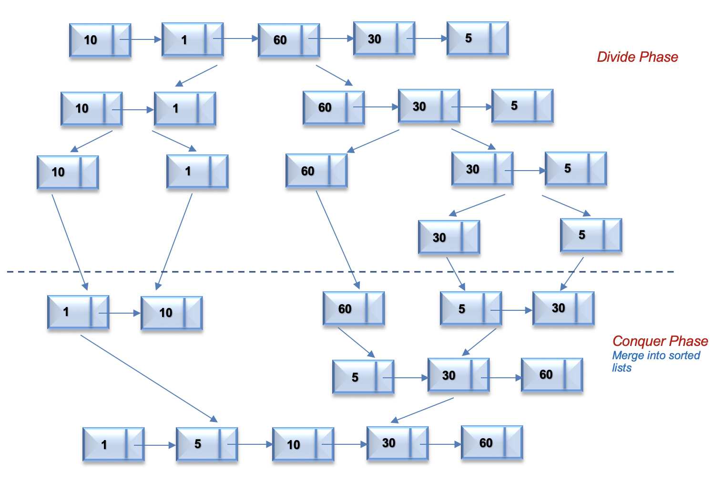

# LinkedList
## Merge k sorted lists
You are given an array of k linked-lists and each linked list is sorted in ascending order. Merge all the linked lists into one sorted linked list.

### Solution 1: Brute Force
Time complexity: O(nlogn)\
Space complexity: O(n)\
n represents the number of nodes in linked lists.
```java
class Solution {
    public ListNode mergeKLists(ListNode[] lists) {
        List<Integer> lst = new ArrayList();
        ListNode fix_head = new ListNode();
        ListNode head = fix_head;
        for (ListNode node : lists){
            while(node != null){
                lst.add(node.val);
                node = node.next;
            }
        };
        Collections.sort(lst);
        for(int num : lst){
            head.next = new ListNode(num);
            head = head.next;
        }
        return fix_head.next;
    }
}
```
### Solution 2: Compare one by one
Time complexity: O(kN)\
Space complexity: O(n)\
n represents the number of nodes, and k is the number of lists
```java
class Solution {
    public ListNode mergeKLists(ListNode[] lists) {
        ListNode fix_result = new ListNode();
        ListNode result = fix_result;
        while(result != null) {
            ListNode smallest = null;
            int j = -1;
            for (int i=0; i < lists.length; i++){
                if(smallest == null && lists[i] != null){
                    smallest = lists[i];
                    j = i;
                }
                if(lists[i] != null && lists[i].val < smallest.val){
                    smallest = lists[i];
                    j = i;
                }
            }
            if(j != -1){
                lists[j] = lists[j].next;
            }
            result.next = smallest;
            result = result.next;
        }
        return fix_result.next;
    }
}
```
### Solution 3: Compare one by one using PriorityQueue
Time complexity: O(nlogk)\
Space complexity: O(n)\
n represents the number of nodes and k represents the number of lists.\
There are n nodes and for every pop and insertion to priority queue, we use O(logk).
Get the smallest value is O(1)
```java
class Solution {
    public ListNode mergeKLists(ListNode[] lists) {
        ListNode fix_result = new ListNode();
        ListNode result = fix_result;
        PriorityQueue<Map.Entry<Integer, ListNode>> q = 
            new PriorityQueue(Comparator.<Map.Entry<Integer, ListNode>>comparingInt(Map.Entry::getKey));
        for(ListNode node : lists){
            if(node != null){
                q.offer(Map.entry(node.val, node));
            }
        }
        while(!q.isEmpty()){
            Map.Entry<Integer, ListNode> item = q.poll();
            result.next = new ListNode(item.getKey());
            result = result.next;
            ListNode node = item.getValue();
            node = node.next;
            if(node != null){
                q.offer(Map.entry(node.val, node));
            }
        }
        return fix_result.next;
    }
}
```
### Solution 4: Merge list one by one
Time complexity: O(kn)\
Space complexity: O(1)\
k represents the number of lists and n represents the number of total nodes.\
Space complexity can be 1 because we can append item to the existing linkedNode.
```java
class Solution {
    public ListNode mergeKLists(ListNode[] lists) {
        if(lists.length == 0){
            return null;
        }else if(lists.length < 2){
            return lists[0];
        }
        ListNode result = mergeTwoListNodes(lists[0], lists[1]);
        for(int i = 2; i < lists.length; i++){
            result = mergeTwoListNodes(result, lists[i]);
        }
        return result;
    }
    
    public ListNode mergeTwoListNodes(ListNode l1, ListNode l2){
        ListNode fix_result = new ListNode();
        ListNode result = fix_result;
        while(l1 != null && l2 != null){
            if(l1.val < l2.val){
                result.next = l1;
                result = result.next;
                l1 = l1.next;
            }else{
                result.next = l2;
                result = result.next;
                l2 = l2.next;
            }
        }
        if(l1 == null){
            result.next = l2;
        }else if(l2 == null){
            result.next = l1;
        }
        return fix_result.next;
    }
}
```
### Solution 5: Merge with divide and conquer
Time complexity: O(nlogk)\
space complexity: O(1)\
k represents the number of lists nad n represents the number of total nodes.\
We will have logk pairs for sorting and we can merge two lists in n times.
```java
class Solution {
    public ListNode mergeKLists(ListNode[] lists) {
        if(lists.length == 0){
            return null;
        }else if(lists.length < 2){
            return lists[0];
        }
        int pairs = lists.length/2 + lists.length%2;
        while(lists.length != 1){
            ListNode[] lst = new ListNode[pairs];
            int j = 0;
            for(int i = 0; i < pairs; i++){
                if(j+1 < lists.length){
                    lst[i] = mergeTwoListNodes(lists[j], lists[j+1]);
                    j=j+2;
                }else{
                    lst[i] = lists[j];
                    j++;
                }
            }
            lists = lst;
            pairs = lists.length/2 + lists.length%2;
        }
        
        return lists[0];
    }
    
    public ListNode mergeTwoListNodes(ListNode l1, ListNode l2){
        ListNode fix_result = new ListNode();
        ListNode result = fix_result;
        while(l1 != null && l2 != null){
            if(l1.val < l2.val){
                result.next = l1;
                result = result.next;
                l1 = l1.next;
            }else{
                result.next = l2;
                result = result.next;
                l2 = l2.next;
            }
        }
        if(l1 == null){
            result.next = l2;
        }else if(l2 == null){
            result.next = l1;
        }
        return fix_result.next;
    }
}
```
## Sort List
Given the head of a linked list, return the list after sorting it in ascending order.

```java
class Solution {
    public ListNode sortList(ListNode head) {
        if (head == null || head.next == null)
            return head;
        ListNode mid = getMid(head);
        ListNode left = sortList(head);
        ListNode right = sortList(mid);
        return merge(left, right);
    }

    ListNode merge(ListNode list1, ListNode list2) {
        ListNode dummyHead = new ListNode();
        ListNode tail = dummyHead;
        while (list1 != null && list2 != null) {
            if (list1.val < list2.val) {
                tail.next = list1;
                list1 = list1.next;
                tail = tail.next;
            } else {
                tail.next = list2;
                list2 = list2.next;
                tail = tail.next;
            }
        }
        tail.next = (list1 != null) ? list1 : list2;
        return dummyHead.next;
    }

    ListNode getMid(ListNode head) {
        ListNode midPrev = null;
        while (head != null && head.next != null) {
            midPrev = (midPrev == null) ? head : midPrev.next;
            head = head.next.next;
        }
        ListNode mid = midPrev.next;
        midPrev.next = null;
        return mid;
    }
}
```
Time complexity: O(nlogn)\
Space complexity: O(1)