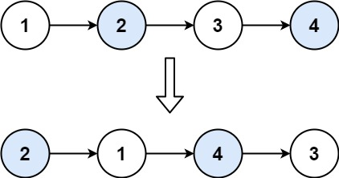

# Recursion
## Swap Nodes in Pairs
Given a linked list, swap every two adjacent nodes and return its head. You must solve the problem without modifying the values in the list's nodes (i.e., only nodes themselves may be changed.)



### Solution:
```java
/**
 * Definition for singly-linked list.
 * public class ListNode {
 *     int val;
 *     ListNode next;
 *     ListNode() {}
 *     ListNode(int val) { this.val = val; }
 *     ListNode(int val, ListNode next) { this.val = val; this.next = next; }
 * }
 */
class Solution {
    public ListNode swapPairs(ListNode head) {
        //base case
        if(head == null || head.next == null){
            return head;
        }
        
        ListNode otherNodes = null;
        if(head.next.next != null){
            otherNodes = swapPairs(head.next.next);
        }
        
        ListNode oldHead = head;
        head = head.next;
        head.next = oldHead;
        head.next.next = otherNodes;
        return head;
        
    }
}
```
